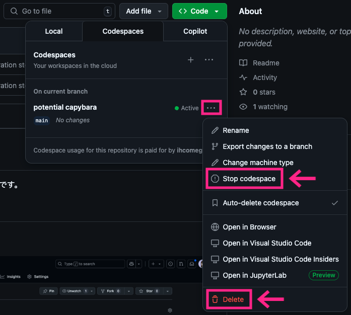

# GHCP-intro-handson

GitHub Copilotをこれから活用したい方向けのハンズオンです。
ハンズオン用資料とソースコード、サンプルアプリケーションの実行方法は[handsonディレクトリ](handson)内にあります。

## 事前準備

### ローカル環境を使う場合

既にインストール済みのものはスキップしてください。

1.  [Visual Studio Code](https://code.visualstudio.com/download) をインストールします。なるべく最新バージョンを推奨しますが、最低限Copilot Chatが使用できることをご確認ください。
1. 【Gitを使う場合】クローン
    1. [Gitをインストール](https://git-scm.com/book/ja/v2/%E4%BD%BF%E3%81%84%E5%A7%8B%E3%82%81%E3%82%8B-Git%E3%81%AE%E3%82%A4%E3%83%B3%E3%82%B9%E3%83%88%E3%83%BC%E3%83%AB)します。
    1. [本リポジトリ](https://github.com/ihcomega56/GHCP-intro-handson2504) をクローンします。
1. 【Gitを使わない場合】ZIPダウンロード
    1. 自分のアカウントのリポジトリ上で右上の **`Code` ボタンをクリック** します。
        
    1. **`Download ZIP` ボタンをクリック** します。
        
1. クローンまたはZIPダウンロード・展開したフォルダを Visual Studio Code で開きます。左上のメニューで **ファイル** -> **フォルダーを開く** と選択し、フォルダを選択してください。

### Codespacesを使う場合

1. [本リポジトリ](https://github.com/ihcomega56/GHCP-intro-handson2504) にアクセスし、フォークします。
1. 自分のアカウントのリポジトリ上で右上の **`Code` ボタンをクリック** します。
    
1. **`Codespaces` タブをクリック** します。
    
1. **`Create codespace on main` ボタンをクリック** します。
    
1. ブラウザ上で Visual Studio Code の画面が立ち上がれば準備完了です。
    

## 終了時の作業： Codespacesのインスタンス停止・削除

1. 事前準備時と同じ `Codespaces` タブでアクティブなCodespacesの隣にある **メニュー（三点リーダのような形）をクリック** します。
1. Codespacesを停止したい場合は **`Stop Codespace` をクリック**、削除したい場合は **`Delete` をクリック** します。消えたら困る途中の作業がない限り、 `Delete` を選択して構いません。
    
