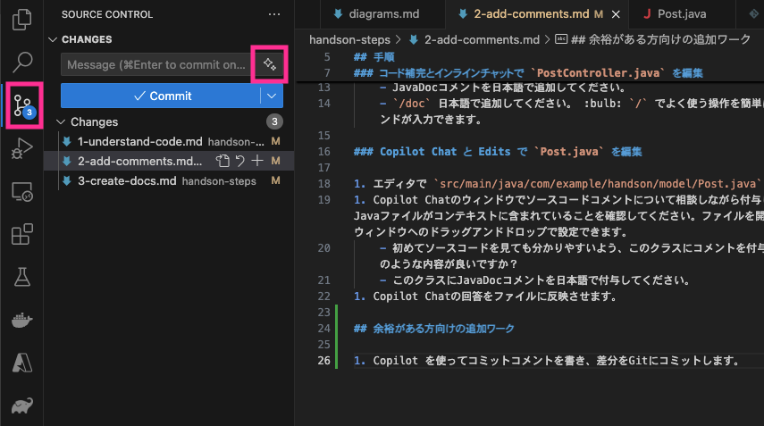

## この章でやること

Visual Studio Code上で、ソースコードコメントを付与してみましょう！

## 手順

### コード補完とインラインチャットで `PostController.java` を編集

1. エディタで `src/main/java/com/example/handson/controller/PostController.java` を開きます。 :bulb: Win: Ctrl+p, Mac: Cmd+p でファイル名検索ができます。
1. クラス定義のすぐ上の行（12行目あたり）で `/**` と入力しTabキーを押します。GitHub Copilotのコード補完によりソースコードコメントが入力されることを確認します。
1. GitHub Copilotとのインラインチャットで明確に指示を出し、クラスやメソッドにソースコードコメントを付与します。 :bulb: Win: Ctrl+i, Mac: Cmd+i でインラインチャットが開きます。
    - JavaDocコメントを日本語で追加してください。
    - `/doc` 日本語で追加してください。 :bulb: `/` でよく使う操作を簡単に依頼できるコマンドが入力できます。

### Copilot Chat と Edits で `Post.java` を編集

1. エディタで `src/main/java/com/example/handson/model/Post.java` を開きます。
1. Copilot Chatのウィンドウでソースコードコメントについて相談しながら付与します。該当Javaファイルがコンテキストに含まれていることを確認してください。ファイルを開くか、チャットウィンドウへのドラッグアンドドロップで設定できます。前の手順で行ったチャット変数 `#file` の使用も可能です。 :bulb: コンテキストの含め方の違いは口頭で補足します。
    - 初めてソースコードを見た人でも分かりやすいよう、このクラスにコメントを付与したいです。どのような内容が良いですか？
    - このクラスにJavaDocコメントを日本語で付与してください。
1. Copilot Chatの回答をファイルに反映させます。 :bulb: 反映のさせ方にはいくつか種類があります。

## 余裕がある方向けの追加ワーク

1. Copilot を使ってコミットコメントを書き、差分をGitにコミットします（専用ブランチの作成をオススメします）。Gitタブで✨️アイコンをクリックするとコミットコメントが自動生成されます。
    
1. アプリケーションを実行します。手順は[アプリケーションのREADME](https://github.com/ihcomega56/GHCP-intro-handson2504/blob/main/handson/.gitattributes)にあります。